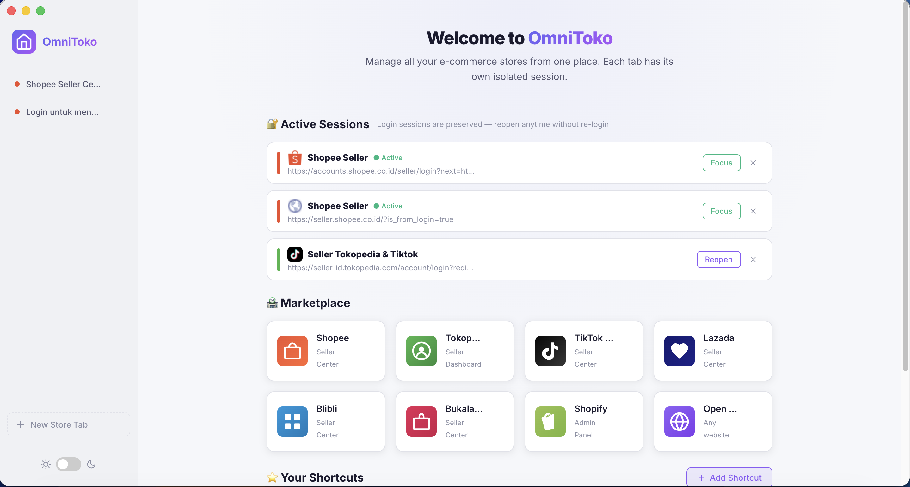
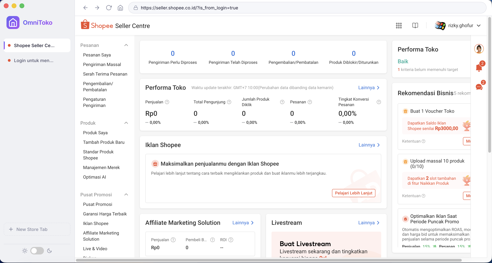
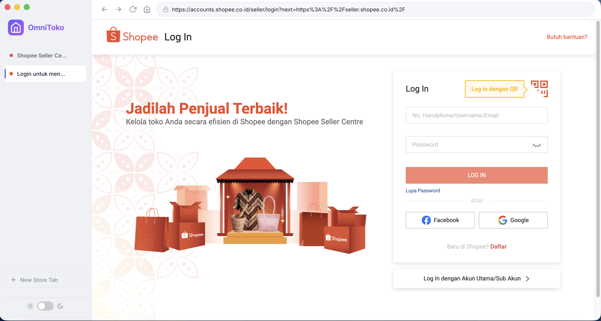

# 🏪 OmniToko

**Multi-session e-commerce store manager** — manage all your online store logins from one desktop app, without conflicts.

Built with [Electron.js](https://www.electronjs.org/).

---

### 📸 Application Preview

<p align="center">
  
</p>
<p align="center">
  
  
</p>

---

## ✨ Features

### 🔐 Session Isolation

Each tab runs in a **completely isolated session**. Login to Shopee on Tab 1, Tokopedia on Tab 2, and they will never interfere — no more switching browsers!

### 💾 Persistent Sessions

Login sessions are **saved and persist** across tab close/reopen:

- Close a tab, reopen later — **you're still logged in!**
- Dashboard shows all sessions with **Reopen** / **Focus** / **Delete** controls

### 🏠 Dashboard

Branded home page with quick-access marketplace shortcuts: Shopee, Tokopedia, TikTok Shop, Lazada, Blibli, Bukalapak, Shopify, and custom URLs.

### 🗂️ Session Control & Organization

- **Reopen / Focus / Delete** controls for every session
- **Session Groups**: Automatically categorizes active sessions by their storefront domain
- **Session Rename**: Click ✎ to rename auto-generated sessions (e.g., "Shopee Seller" → "Toko Baju - Shopee")
- **Scrollable List View**: Active sessions cleanly scroll internally when maximizing vertical workspace

### 🛡️ Advanced Session Features (Pro Tools)

- **Per-Session Proxy (`HTTP`/`SOCKS`)**: Assign a unique proxy IP to a specific session. Mask your store's geographical fingerprint to avoid platform bans!
- **Custom User-Agent**: Spoof the origin browser fingerprint for any session (e.g., simulate an iPhone or custom Desktop Chrome).
- **Clear Cookies**: Securely nuke isolated session data, cache, and cookies for a single account without affecting adjacent sessions.
- **Duplicate Session**: Instantly clone an active tab. The new tab inherits the exact authorization token partition, letting you manage the same shop in multiple windows simultaneously!

### ⭐ Custom Shortcuts

Add your own shortcuts with name, URL, custom color picker, and auto-fetched favicons.

### 🌗 Dark / Light Mode

Toggle between themes with persistent preference storage.

### ⌨️ Keyboard Shortcuts

| Shortcut               | Action              |
| ---------------------- | ------------------- |
| `Cmd/Ctrl + T`         | New Tab (Dashboard) |
| `Cmd/Ctrl + W`         | Close Current Tab   |
| `Cmd/Ctrl + R`         | Reload Tab          |
| `Cmd/Ctrl + L`         | Focus URL Bar       |
| `Cmd/Ctrl + Shift + H` | Go to Dashboard     |
| `Cmd/Ctrl + Shift + ]` | Next Tab            |
| `Cmd/Ctrl + Shift + [` | Previous Tab        |
| `Cmd/Ctrl + 1-9`       | Switch to Tab 1-9   |
| `Cmd/Ctrl + +`         | Zoom In             |
| `Cmd/Ctrl + -`         | Zoom Out            |
| `Cmd/Ctrl + Scroll`    | Pinch to Zoom       |

### 🖱️ Context Menu (Right-Click)

Full right-click menu on web pages:

- **Link**: Open in new tab, Copy link
- **Image**: Copy image, Save image as
- **Text**: Cut, Copy, Paste, Select All
- **Page**: Back, Forward, Reload

### 📥 Download Manager

- Automatic download handling with save dialog
- Toast notifications with real-time progress bar
- Completion/failure notifications with auto-dismiss

### 🚀 Advanced Productivity

- **System Tray**: App minimizes to tray instead of quitting, running silently in the background (Windows/Linux)
- **Notification Badges**: Sidebar tabs show red notification counters dynamically parsed from website titles (e.g., `(2) New Orders`)
- **Tab Reordering**: Use drag-and-drop on the sidebar tabs to customize your workspace layout
- **Data Backup (Import/Export)**: Use the sidebar buttons to export or import all your shortcuts, sessions, and preferences directly to/from a JSON backup file
- **Toggle Layout**: Change the sidebar position dynamically from the traditional vertical left side to a horizontal top layout
- **Native Zoom Support**: Use the UI buttons (+, -) in the navigation bar or use native trackpad pinch-to-zoom (Cmd/Ctrl + Scroll) to scale store UI

### 🖥️ Cross-Platform

- **macOS**: Hidden title bar with traffic lights
- **Windows/Linux**: Standard title bar
- Custom app icon (replaceable via `assets/icon/`)

---

## 🚀 Getting Started

### Prerequisites

- [Node.js](https://nodejs.org/) v18+

### Install & Run

```bash
cd OmniToko
npm install
npm start
```

---

## 📦 Building for Distribution

### macOS

```bash
npm run build:mac
```

Output: `dist/OmniToko-x.x.x.dmg` + `.zip`

### Windows

```bash
npm run build:win
```

Output: `dist/OmniToko Setup x.x.x.exe` (installer) + portable

### Linux

```bash
npm run build:linux
```

Output: `dist/OmniToko-x.x.x.AppImage` + `.deb`

### All platforms

```bash
npm run build
```

---

## 🎨 Custom App Icon

Replace `assets/icon/icon.png` with your own **1024×1024 PNG** icon before building.

See `assets/icon/README.md` for format conversion instructions (`.icns` for macOS, `.ico` for Windows).

---

## 🗂️ Project Structure

```
OmniToko/
├── main.js          # Main process — windows, IPC, shortcuts, context menu, downloads
├── preload.js       # Secure bridge between main and renderer
├── renderer.js      # UI logic — dashboard, tabs, sessions, download toasts
├── index.html       # Layout — sidebar, dashboard, modals
├── styles.css       # Themes, responsive design, animations
├── assets/
│   └── icon/
│       ├── icon.png # App icon (1024×1024)
│       └── README.md
├── package.json     # Config & build settings
└── README.md
```

### Data Storage

| File               | Contents         | Location                                          |
| ------------------ | ---------------- | ------------------------------------------------- |
| `shortcuts.json`   | Custom shortcuts | `~/Library/Application Support/OmniToko/` (macOS) |
| `sessions.json`    | Login sessions   | `%APPDATA%/OmniToko/` (Windows)                   |
| `preferences.json` | Theme preference | `~/.config/OmniToko/` (Linux)                     |

---

## 🛠️ Tech Stack

| Technology                   | Purpose                  |
| ---------------------------- | ------------------------ |
| Electron v40                 | Desktop framework        |
| BaseWindow + WebContentsView | Modern window APIs       |
| session.fromPartition()      | Session isolation        |
| Google Favicon API           | Auto-fetch icons         |
| electron-builder             | Cross-platform packaging |

---

## 📝 License

ISC
